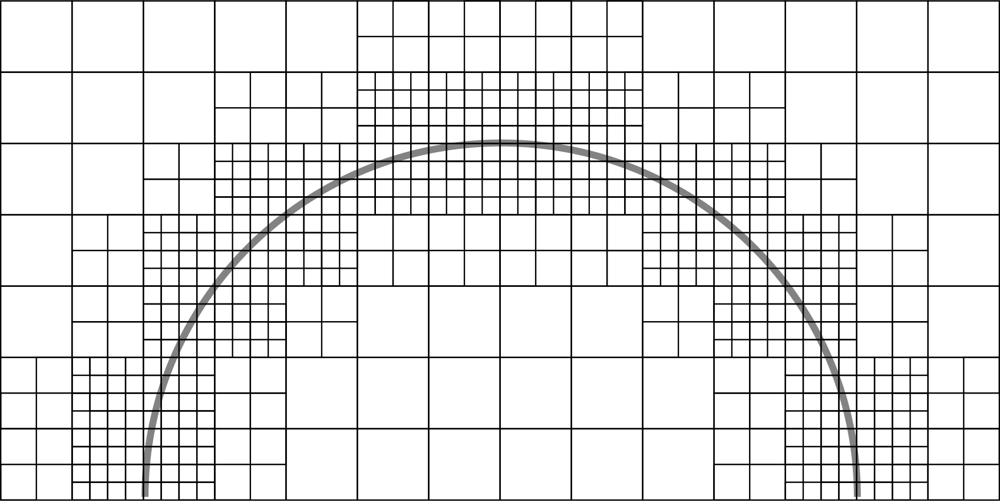
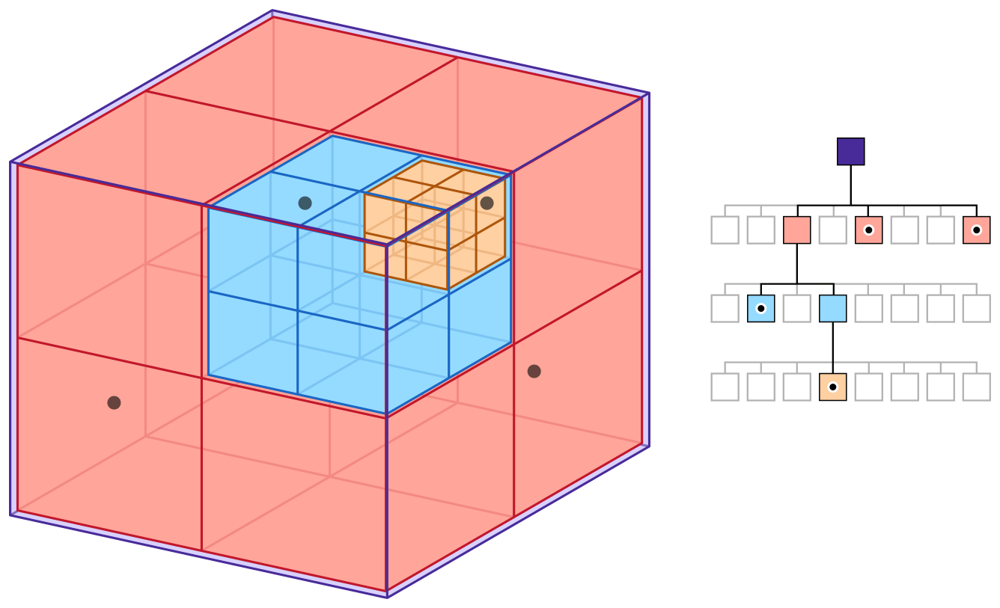
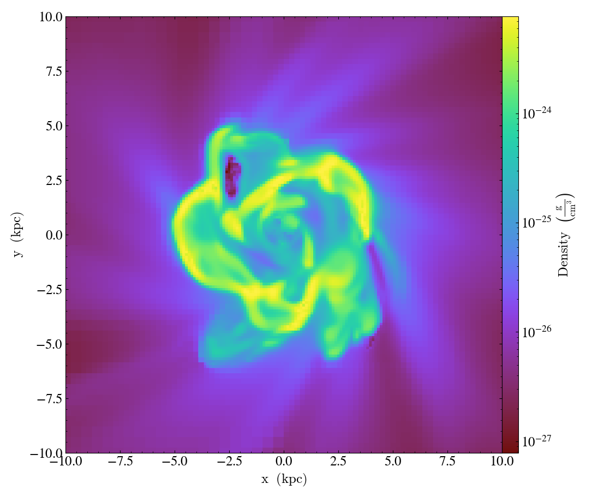
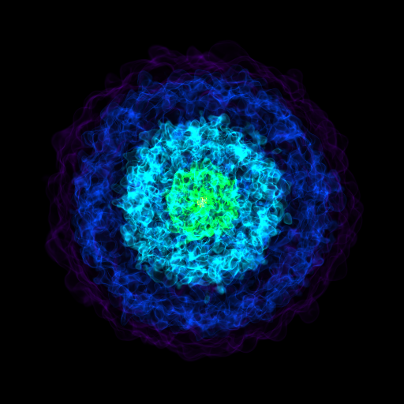

## Volumetric Simulations
- Formation of stars and galaxies
- Nuclear reactor mechanics
# Why?
Connects theories with data
## What
- Enzo: **Adaptive Mesh Refinement** (AMR) astrophysical simulation code
    [@Bryan_2014]
    - Multi-purpose
Adaptive Mesh Refinement
    ~ Increase simulation accuracy in turbulent or interesting parts
    ~ Inconsistent

## Enzo-E
- Enzo-E: Rearchitecture of Enzo for exascale computing [@bordner2018]
    - Datasets $ >1 $ TB or $ >2048^3 $ blocks
<!-- - {if time mention Cello} -->
- Uses **array-of-octree** AMR
Octree:
    ~ Tree data structure to represent 3D space
    ~ Recursively subdivided
Array-of-octree
    ~ 3D Array of Octrees
    ~ Easily parallelizable

## yt
- yt: Python analysis and visualization package [@turk]
- For any type of volumetric data 
    - Both Enzo and Enzo-E
- Supports a variety of *frontends* to load data
- Supports a variety of formats
    - Grid-based
        - Inconsistent across the domain
    - Array-of-octree

# Problem
Enzo-E analysis in yt is slow!
## Problem
- Slow on large datasets
- Can't practically analyze enzo-e datasets of over $256^3$ blocks
    - $256^3$ blocks -> multiple hours to load in the data
- Needs to analyze datasets of size $2048^3$ blocks
    - $\approx 1$ TB
## Current Frontend
- Collection of grids
    - Each grid is a python object
        - $\approx 1$ KB
- Largely single threaded
## New frontend
- Array of Octree
- Multithreaded
- Each Oct is a c struct
    - at most 88 bytes
## Result
- Faster
- Can analyze datasets of size $2048^3 blocks$
    - $\approx 1$ TB
## Current Status
- New frontend is partially built
- Incorrect visualizations {add plot}
## Future Work
- New frontend is unoptimized
    - Initially slower
- Other simulation codes interpreted as grid-based, not oct-based
## References

